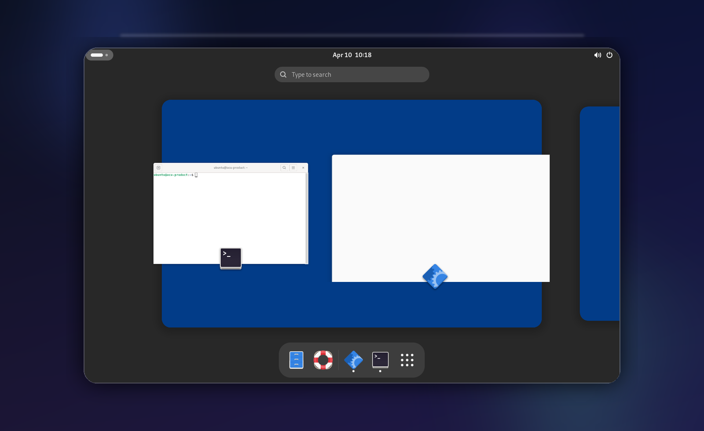

<h1 align="center">Agent Computer Use Platform</h1>

<p align="center">A desktop automation platform for AI agents that need a real Linux session.<br />QEMU/KVM first in production, with an honest Xvfb fallback for local development and verification.</p>

<p align="center">
  
  
  
  
  
</p>

<p align="center">
  
</p>

<p align="center">
  <a href="docs/getting-started.md"><strong>Getting started</strong></a>
  ·
  <a href="docs/README.md"><strong>Documentation</strong></a>
  ·
  <a href="docs/api-reference.md"><strong>API reference</strong></a>
  ·
  <a href="docs/architecture.md"><strong>Architecture</strong></a>
</p>

Agent Computer Use Platform gives agents a real Linux desktop to work in, with screenshots, shell access, files, desktop input, and an operator view that makes the current session state easy to follow.

## What it does

- Runs agent tasks inside disposable Linux sessions instead of collapsing everything into a browser tab.
- Gives you one place to work with screenshots, shell commands, files, desktop input, and session state.
- Keeps operators in the loop with a live desktop view, structured receipts, and clear fallback modes.
- Exposes a `review_recording` summary for qemu `product` sessions and lets you explicitly export a sparse review bundle for later human review instead of recording default video.

## Default flow

The default happy path is now:

1. Start a session with default settings (`qemu` + `product`)
2. Wait for readiness
3. Submit a task
4. Watch `live_desktop_view` or the truthful screenshot fallback
5. Export the sparse review bundle if you want durable evidence for later review
6. Delete the session when done; only exported bundles survive session teardown

QEMU review recording is intentionally storage-first in v1: the durable artifact is a sparse review bundle (`review.json`, `timeline.jsonl`, deduplicated screenshots), not a continuous video capture.

That is the workflow agents should infer first. Advanced/debug controls still exist, but they are secondary.

## Quickstart

```bash
bun ci
bun run build
bun run --filter @acu/sandbox-runner start
```

Open `http://127.0.0.1:3000`, create a session, and drive it through the control plane or the SDKs. For the full local setup, smoke eval, examples, and install notes, start with the [getting started guide](docs/getting-started.md).

Prefer Nix on Linux? This repo now ships a flake for the reproducible source-first path:

```bash
nix develop
bun run build
nix build .#guest-runtime
```

You can also install the Rust binaries directly from the flake with `nix profile install .#guest-runtime` or `nix profile install .#export-schemas`.

On Arch Linux, the packaged desktop app is also available through the AUR with `paru`:

```bash
paru -S inspectors-desktop-bin
# or build from source packages instead:
paru -S inspectors-desktop
paru -S inspectors-desktop-git
```

Use the AUR packages when you want the packaged desktop app on Arch. For source checkouts, local builds, and the full development stack, keep following the [getting started guide](docs/getting-started.md). The AUR packaging source of truth lives under [packaging/aur](packaging/aur/README.md).

## Documentation

- [Getting started](docs/getting-started.md)
- [Architecture](docs/architecture.md)
- [API reference](docs/api-reference.md)
- [QEMU guest bridge](docs/qemu-guest-bridge.md)
- [Security model](docs/security-model.md)
- [Release checklist](docs/release.md)
- [Eval tasks and fixtures](evals/README.md)

## Status

Alpha. QEMU/KVM is the product path; Xvfb stays in the repo as the lighter local fallback and regression lane.

## License

MIT. See [LICENSE](LICENSE).
